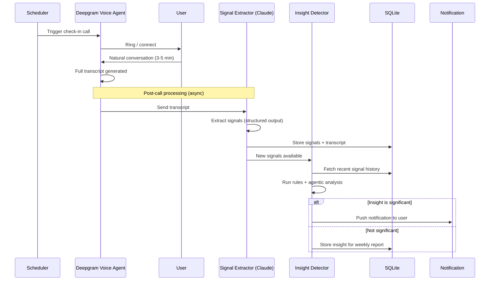
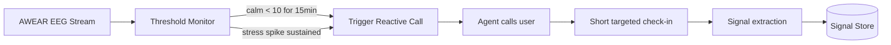

# MoodTrack — Architecture & Build Plan

## The Problem

Mood tracking apps fail because they demand active effort — daily forms, sliders, journal entries. 90% of users quit within 2 weeks. The friction kills it.

## The Solution

An agent that **calls you** and has a natural conversation. You talk for 3-5 minutes. That's it. Behind the scenes, it extracts emotional signals, builds a picture over time, and only bothers you when it finds something worth knowing.

## The Pitch Angle (from hackathon session)

**"AWEAR tells you *what* your brain is doing. We tell you *why*."**

AWEAR's neuroscientist stated their biggest gap: they have brain state data (stressed, calm, focused) but no context about what caused it. Our conversation layer IS that missing context. AWEAR shows a stress spike at 2pm — our system knows it's because you had back-to-back meetings and skipped lunch. Together: the full picture.

**Hackathon themes we hit:**
- Amplifying behavioral or biometric self-awareness (primary)
- Proactive rather than reactive living (push insights before crisis)
- Emotional reframing (agent reflects your patterns back to you)

---

## 1. How It Actually Works (User's Perspective)

```
Day 1:    Phone rings → "Hey, how's it going?" → Talk for 3 min → Done.
Day 2-6:  Same thing. Maybe you skip a day. That's fine.
Day 7:    Notification: "You've been consistently low-energy on days 
          you mentioned skipping lunch. Might be worth noticing."
Day 14:   You're curious. Open the dashboard. See your mood/energy 
          trends. Ask "what patterns do you see?" Get an answer.
```

The user does NOT:
- Open an app daily
- Fill out forms
- Check dashboards (unless they want to)
- Do anything except pick up the phone and talk

## 2. System Architecture

```mermaid
graph TB
    subgraph "Conversation Layer"
        SCHEDULE[Scheduler<br/>Cron / Serverless Trigger] --> CALL[Initiate Call]
        CALL --> DG[Deepgram Voice Agent<br/>STT → LLM → TTS]
        USER[User picks up] <--> DG
        DG --> TRANSCRIPT[Conversation Transcript]
    end

    subgraph "Processing Layer (runs after each call)"
        TRANSCRIPT --> EXTRACT[Signal Extractor<br/>Claude Structured Output]
        EXTRACT --> SIGNALS[(Signal Store<br/>SQLite)]
        SIGNALS --> INSIGHT[Insight Detector<br/>Claude + Rules Engine]
        INSIGHT -->|significant| NOTIFY[Push Notification]
        INSIGHT -->|not significant| STORE[Store for later]
    end

    subgraph "Signal Providers (Extensible)"
        CONV[Conversation Analyzer] --> SIGNALS
        VIBES[Vibes AI<br/>Voice Biomarkers] -.-> SIGNALS
        AWEAR_P[AWEAR<br/>EEG Data] -.-> SIGNALS
        HEALTH[Apple Health /<br/>Fitbit] -.-> SIGNALS
    end

    subgraph "User-Initiated (Pull)"
        DASH[Dashboard<br/>Plotly.js] --> SIGNALS
        INSIGHTS_CHAT[Insights Chat<br/>"Show me my patterns"] --> SIGNALS
        INSIGHTS_CHAT --> VIZ[On-demand Charts]
    end

    style VIBES stroke-dasharray: 5 5
    style AWEAR_P stroke-dasharray: 5 5
    style HEALTH stroke-dasharray: 5 5
    style NOTIFY fill:#f96
```

## 3. Data Flow — After Each Call



## 4. The Signal Model

Every data source — conversation, voice biomarkers, EEG, wearables — produces the same shape:

```python
class Signal(BaseModel):
    id: str                    # uuid
    timestamp: datetime
    source: str                # "conversation" | "vibes_ai" | "awear" | "manual"
    signal_type: str           # "mood" | "energy" | "stress" | "anxiety" | 
                               # "sleep_quality" | "focus" | "social"
    value: float               # 1-10 normalized
    label: str                 # "low" | "moderate" | "high" etc.
    confidence: float          # 0.0-1.0
    context: str               # "User mentioned back-to-back meetings and skipping lunch"
    conversation_id: str|None
    metadata: dict             # source-specific extras
```

### What Gets Extracted Per Conversation

| Signal | Example | Source Cue |
|--------|---------|------------|
| mood | 3/10 "low" | Overall emotional tone |
| energy | 4/10 "low-moderate" | Tiredness, activity, food mentions |
| stress | 7/10 "elevated" | Work pressure, deadlines, tension in voice |
| anxiety | 6/10 "moderate-high" | Worry language, future-oriented concerns |
| sleep_quality | 5/10 "adequate" | Self-reported sleep info |
| social | null | Only if mentioned |
| topics | ["work","deadline"] | Key themes (stored in metadata) |
| concerns | ["Friday deadline"] | Specific worries flagged |

### Signal Provider Interface

```python
class SignalProvider(ABC):
    name: str
    signal_types: list[str]

    async def extract(self, raw_data: Any) -> list[Signal]:
        """Convert raw source data into normalized Signals."""
        ...
```

- `ConversationProvider` — extracts from transcripts (MVP)
- `VibesAIProvider` — future: voice biomarker scores from MANTRA (runs on stored audio). No SDK; reverse engineering encouraged by Vibes AI team.
- `AWEARProvider` — AWEAR has a research portal with API key access to raw EEG data. Integration is possible TODAY. Each team can have a researcher account with API access.
- `HealthKitProvider` — future: sleep, steps, heart rate

## 4b. Conversation Agent Personas

The check-in agent's behavior is defined by a **persona config** — a named system prompt that controls how the agent conducts the conversation. This is swappable, not hardcoded.

### Built-in Personas

| Persona | Style | Best For |
|---------|-------|----------|
| **listener** | Minimal talking. "Mmhmm." "Anything else?" "Take your time." Lets silence sit. | Users who want to vent/dump without interruption |
| **reflective** (default) | Listens, then mirrors back. "It sounds like..." Asks one follow-up at a time. | Most users — feels like talking to a good friend |
| **structured** | Loosely follows a checklist: mood, energy, sleep, food, social. Still conversational. | Users who prefer consistency across check-ins |

### Architecture

```python
class AgentPersona(BaseModel):
    name: str           # "listener" | "reflective" | "structured"
    system_prompt: str  # The full system prompt for the conversation agent
    description: str    # User-facing description

# Stored in config, loaded at conversation start
PERSONAS: dict[str, AgentPersona] = { ... }
```

For the hackathon: ship "reflective" as the default. The persona is just a config key passed when starting a check-in. Future: users customize or build their own via UI.

## 4c. Audio Recording

Raw audio from each conversation is stored alongside the transcript. This is critical for future Vibes AI integration — MANTRA analyzes acoustic features (pitch, pauses, rhythm, volume) that only exist in the audio, not the transcript.

### Storage

```
data/
├── conversations/
│   ├── 2026-05-30_0915/
│   │   ├── audio.webm        # Raw recording
│   │   ├── transcript.json   # Timestamped transcript
│   │   └── signals.json      # Extracted signals
│   └── 2026-05-31_2100/
│       └── ...
```

For the hackathon MVP: capture audio via browser MediaRecorder API → store as webm file on the server. Lightweight, no extra dependencies.

## 4d. Call Triggers

The agent doesn't only call on a schedule. It monitors external signals and calls when something warrants attention.

### Trigger Types

| Trigger | Source | Example | Call Style |
|---------|--------|---------|------------|
| **Scheduled** | Cron / user config | Daily 8pm check-in | Full check-in (3-5 min) |
| **Reactive** | AWEAR EEG stream | Stress sustained > 15 min, calm score < 10 | Short intervention — "Your brain's been running hot. What's going on right now?" |
| **User-initiated** | User calls in | "I need to talk" | Full check-in, user-led |

### Reactive Call Flow



The reactive persona is different from a full check-in — shorter, more direct, not probing. Just: acknowledge, ask what's happening, offer one grounding prompt if appropriate, and let the user go. Under 2 minutes.

For the hackathon MVP: this is future work. But the trigger architecture should be visible in the demo — show that calls can be event-driven, not just scheduled.

## 5. Insight Detection

Two types of insights. Both produce the same output (a notification-worthy observation), but they find things differently.

### Programmatic (rules we define)

```python
RULES = [
    # Sustained low mood
    "mood < 4 for 3+ consecutive check-ins",
    # Recurring pattern
    "stress consistently > 7 on same day of week",
    # Correlation
    "mood drops on days sleep_quality < 4",
    # Missing data
    "no check-in for 3+ days (might itself be a signal)",
]
```

### Agentic (LLM-discovered)

After each call, pass recent signal history to Claude and ask:

> "Here are the user's signals from the past 2 weeks. Is there anything notable, surprising, or worth surfacing? Only flag things that would genuinely be useful for the user to know. If nothing stands out, say so."

This catches patterns we didn't think to program — like "you tend to feel better on days you mention talking to your sister" or "your energy crashes every Wednesday, which is when you have 4 hours of meetings."

### Notification Threshold

Not every insight should ping the user. Filter by:
- **Severity:** Low mood for 3 days > single bad day
- **Novelty:** Only surface a pattern the first time it's detected
- **Actionability:** "You feel worse when you skip lunch" > "Your mood varies"

## 6. Hackathon MVP — What to Build in 8 Hours

### What's IN scope

| Priority | What | Time | Why |
|----------|------|------|-----|
| P0 | FastAPI backend + SQLite schema + project setup | 30m | Foundation |
| P0 | Signal extraction from transcript (Claude structured output) | 45m | Core data pipeline |
| P0 | REST API for signals (store, query by date/type) | 30m | Data access |
| P0 | Web chat interface for check-in conversations | 60m | Demo the conversation |
| P0 | Voice I/O + audio recording (WebSpeech in, SpeechSynthesis out, MediaRecorder saves audio) | 30m | Voice works + audio stored for future Vibes AI |
| P1 | Dashboard — mood/energy/stress timeline (Plotly.js) | 60m | Visualize patterns |
| P1 | Summary cards — today's snapshot, weekly trend, top themes | 30m | Quick glance value |
| P1 | Seed data — 7-14 days of realistic historical signals | 20m | Make dashboard compelling |
| P2 | Insights chat — ask questions about your data, get charts | 60m | "Show me my patterns" |
| P2 | Insight detection — rules + agentic analysis after each convo | 45m | The push notification story |
| P3 | UI polish, demo rehearsal | 30m | Demo-ready |

### What's OUT of scope (future)

- Deepgram Voice Agent integration for real phone calls (show the config we already wrote)
- Vibes AI / AWEAR integration (show the provider interface)
- Actual push notifications (describe the flow, mock it)
- Scheduling / cron for automated calls
- User auth, multi-user support
- OpenClaw for multi-channel access (WhatsApp, Telegram, etc.)
- **Domain expert refinement** — conversation agent prompts and signal extraction should be validated/refined with psychologists, therapists, and neuroscientists. The current prompts are best-guess; clinical input would improve what signals to extract, how to ask follow-ups, and what patterns are actually meaningful vs. noise.
- **Therapist-in-the-loop** — user could escalate from AI check-in to a real therapist call (with consent). That session gets recorded and fed into the same signal pipeline, giving the therapist longitudinal context and the user continuity between AI check-ins and human sessions.
- **Professional dashboard** — a therapist-facing view of the user's signal history, so they arrive at sessions with context instead of starting cold each time.

### Hour-by-hour plan

| Hour | Focus | Checkpoint |
|------|-------|------------|
| 1-2 | Backend: FastAPI, SQLite, signal model, extraction endpoint | Can extract signals from a transcript |
| 2-4 | Frontend: chat UI, WebSocket, voice I/O, conversation agent prompt | Can have a voice conversation and see signals |
| 4-5 | Dashboard: Plotly charts, summary cards, REST endpoints | Can see mood trends over time |
| 5-6 | Seed data + insights chat | Dashboard looks compelling, can ask questions |
| 6-7 | Insight detection + polish | Full loop: talk → extract → detect → surface |
| 7-8 | Demo prep, edge cases, rehearse pitch | Ready to present |

## 7. File Structure

```
mood-track/
├── CLAUDE.md                 # Project context for AI sessions
├── docs/
│   └── plan.md               # This file
├── research/                 # Hackathon research + Deepgram agent config
│   ├── raw_sources.md
│   ├── hackathon_event.md
│   ├── vibes_ai_mantra.md
│   ├── awear_eeg.md
│   ├── openclaw_reference.md
│   └── deepgram-test-agent.md
├── server.py                 # FastAPI: WebSocket + REST + static serving
├── agent.py                  # Claude prompts: check-in agent, signal extractor, insights agent
├── signals.py                # Signal model, provider interface, extraction logic
├── db.py                     # SQLite setup, queries
├── static/
│   ├── index.html            # SPA: chat tab + dashboard tab
│   ├── style.css
│   ├── app.js                # App shell, routing
│   ├── chat.js               # Chat UI + voice I/O
│   └── dashboard.js          # Plotly charts + summary cards
├── seed_data.py              # Generate realistic demo data
├── requirements.txt
└── .env                      # ANTHROPIC_API_KEY
```

## 8. Demo Script (3 minutes)

1. **Problem** (15s): "Mood tracking apps fail because nobody wants to fill out forms."
2. **Our approach** (15s): "What if tracking your mood felt like a phone call with a friend? No effort. Just talk."
3. **Live demo** (90s):
   - Have a 60-second voice check-in conversation
   - Show signals extracted automatically after the conversation
   - Switch to dashboard: "Here's my past week" (seeded data)
   - Ask insights: "Any patterns in my stress?" → agent generates chart + narration
4. **The context gap** (20s): "AWEAR's team told us their biggest challenge — they can see your brain is stressed, but they can't tell you why. Our conversation layer provides that context. EEG shows a stress spike at 2pm. We know it's because of back-to-back meetings and a skipped lunch."
5. **Architecture** (20s): Show the signal provider diagram. "Conversation, voice biomarkers, EEG — all feed into the same signal model. Plug in any source, get richer patterns."
6. **The push model** (10s): "Users don't check dashboards. We push insights only when they matter."
7. **Close** (10s): "Valuable from day one. You feel heard. Over time, you see what you couldn't see yourself."
